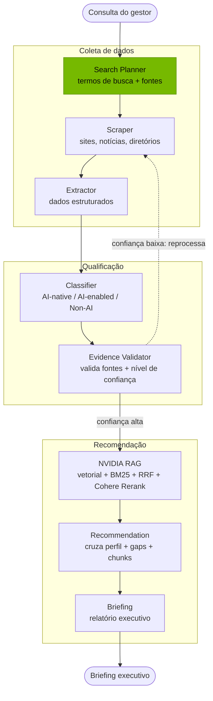

# NVISION — NVIDIA Startup AI Radar

Plataforma multi-agente de inteligência estratégica que mapeia, qualifica e
nutre startups brasileiras com potencial **AI-native** para o programa
**NVIDIA Inception**. Projeto da liga universitária de IA — o foco é
**aprender na prática** LangGraph, RAG com reranking, scraping e o
ecossistema NVIDIA.

> Documentação de UX/arquitetura completa em [`artefatos/ux.md`](artefatos/ux.md).

---

## 🔄 Pipeline multi-agente

A consulta do gestor percorre **8 agentes** orquestrados por LangGraph,
organizados em três blocos: **coleta**, **qualificação** e **recomendação**.




**A aresta condicional importa.** O fluxo não é totalmente linear: o **Evidence Validator** decide o próximo passo conforme o nível de confiança calculado. Se a evidência for sólida, segue para o NVIDIA RAG; se for fraca ou insuficiente, o grafo **volta ao Scraper** para coletar mais dados antes de prosseguir. É esse roteamento condicional com estado compartilhado que justifica usar LangGraph em vez de simplesmente encadear funções — e é um dos principais objetivos de aprendizado do projeto.

---

## 🗂️ Estrutura

```
agents/        # Agentes LangGraph (State, Node, Edge) — começa com grafo de 2 nós
core/          # Config (.env) + abstração de LLM por env var
api/           # Backend FastAPI (REST + WebSocket)
scraping/      # Coleta de dados públicos (Playwright, BeautifulSoup, trafilatura)
rag/           # RAG NVIDIA: ingestão, chunking, embeddings, retrieval, reranking
recommender/   # Motor de recomendação de tecnologias NVIDIA
database/      # Schema PostgreSQL (schema.sql aplicado pelo docker-compose)
frontend/      # Interface web (Vite + React + TS)
tests/         # Testes de fumaça
docker-compose.yml   # Postgres + Qdrant locais
```

Cada módulo tem o **seu próprio README** explicando o quê, o porquê e o que
se aprendeu.

---

## ✅ Pré-requisitos (instalar uma vez)

O ambiente ainda não tem essas ferramentas. Com Homebrew:

```bash
# uv — gerencia Python 3.12 e o venv do backend (rápido)
brew install uv

# Docker Desktop — sobe Postgres + Qdrant
brew install --cask docker
# depois abra o Docker Desktop uma vez para iniciar o daemon
```

> ⚠️ O backend é fixado em **Python 3.12** (`pyproject.toml`). O Python 3.14
> do sistema ainda não tem wheels para várias libs (langgraph, playwright,
> qdrant-client, psycopg). O `uv` instala o 3.12 isoladamente — não mexe no
> Python do sistema.

---

## 🚀 Setup do backend

```bash
# 1. Instala o Python 3.12 e as dependências num venv isolado
uv python install 3.12
uv sync

# 2. Navegadores do Playwright (Entregável 1)
uv run playwright install chromium

# 3. Variáveis de ambiente
cp .env.example .env        # preencha as chaves quando definir o provider de LLM

# 4. Sobe os bancos (precisa do Docker rodando)
docker compose up -d

# 5. Sobe a API
uv run uvicorn api.main:app --reload
#    Health:  http://localhost:8000/health
#    Docs:    http://localhost:8000/docs
```

Rodar o grafo LangGraph isolado (2 nós: `search_planner` real + `echo`
placeholder). Exige `LLM_PROVIDER` e a chave correspondente preenchidos no
`.env` — o primeiro nó já chama um LLM de verdade:

```bash
uv run python -m agents.graph
```

Sem chave configurada, prefira `uv run pytest` — os testes usam um LLM
falso e não dependem de rede nem de chave de API.

Testes de fumaça (não exigem chaves nem bancos no ar):

```bash
uv run pytest
```

---

## 🎨 Setup do frontend

```bash
cd frontend
npm install
npm run dev      # http://localhost:5173 (faz proxy de /api para o backend)
```

---

## 🧭 Onde estamos

Fundação (Semana 0): estrutura, configs, abstração de LLM, grafo de 2 nós,
API `/health` + demo, schema do banco e shell do frontend com as 5 rotas.

Próximo (**Semana 1** do roadmap — ux.md §10): Search Planner Agent +
Scraper Agent reais e a **página Pipeline completa** com live log.
