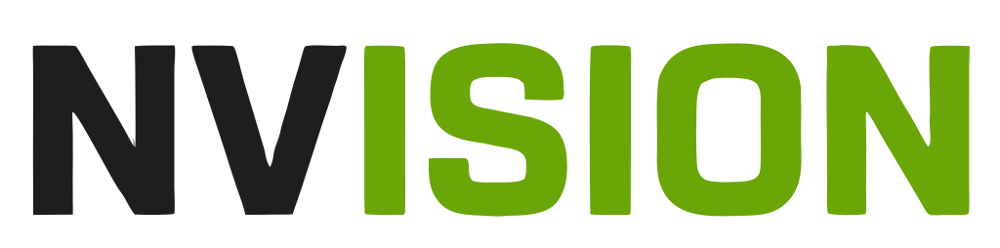
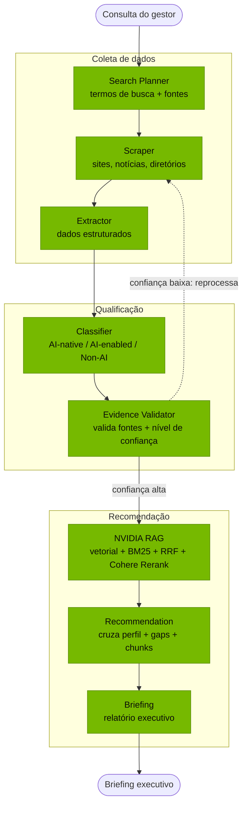

<p align="center">
  <picture>
    <source media="(prefers-color-scheme: dark)" src="assets/logo_branco.svg">
    
  </picture>
</p>

<h1 align="center">NVISION — NVIDIA Startup AI Radar</h1>

<p align="center">
  Plataforma multi-agente que mapeia, qualifica e nutre startups brasileiras
  <br><b>AI-native</b> com potencial para o programa <b>NVIDIA Inception</b>.
</p>

---

Projeto da liga universitária de IA. O foco é **aprender na prática** LangGraph, RAG com reranking, scraping e o ecossistema NVIDIA — a documentação completa de cada agente vive em `artefatos/`.

## Pipeline multi-agente

A consulta do gestor percorre **8 agentes** orquestrados por LangGraph,
organizados em três blocos: **coleta**, **qualificação** e **recomendação**.



**A aresta condicional importa.** O fluxo não é linear: o **Evidence Validator** decide o próximo passo conforme o nível de confiança. Se a evidência for sólida, segue para o NVIDIA RAG; se for fraca, o grafo **volta ao Scraper** para coletar mais dados. É esse roteamento condicional com estado compartilhado que justifica usar LangGraph em vez de encadear funções.

## Estrutura

```
agents/        # Agentes LangGraph (State, Node, Edge)
core/          # Config (.env) + abstração de LLM por env var
api/           # Backend FastAPI (REST + WebSocket)
scraping/      # Coleta de dados públicos (Playwright, BeautifulSoup, trafilatura)
rag/           # RAG NVIDIA: ingestão, chunking, embeddings, retrieval, reranking
recommender/   # Motor de recomendação de tecnologias NVIDIA
database/      # Schema PostgreSQL (aplicado pelo docker-compose)
frontend/      # Interface web (Vite + React + TS)
tests/         # Testes de fumaça
docker-compose.yml   # Postgres + Qdrant locais
```


## Pré-requisitos

Instale duas ferramentas:

- **[uv](https://docs.astral.sh/uv/getting-started/installation/)** — gerencia o Python 3.12 e o venv
- **[Docker Desktop](https://www.docker.com/products/docker-desktop/)** — sobe Postgres + Qdrant (abra uma vez após instalar)

## Backend

```bash
uv python install 3.12
uv sync                                   # dependências num venv isolado
uv run playwright install chromium        # navegadores do scraper
cp .env.example .env                      # preencha as chaves de API
docker compose up -d                      # sobe Postgres + Qdrant (precisa do Docker)
uv run uvicorn api.main:app --reload      # API em http://localhost:8000 (/docs, /health)
```

Rodar o grafo LangGraph isolado (exige `LLM_PROVIDER` + chave no `.env`):

```bash
uv run python -m agents.graph
```

Testes de fumaça (usam um LLM falso — não exigem chaves nem bancos no ar):

```bash
uv run pytest
```

## Frontend

```bash
cd frontend
npm install
npm run dev      # http://localhost:5173 (faz proxy de /api para o backend)
```

Páginas: **Pipeline** (execução com live log), **Qualificadas** (startups
classificadas + briefing) e **Analytics** (KPIs de maturidade de IA e cobertura).
